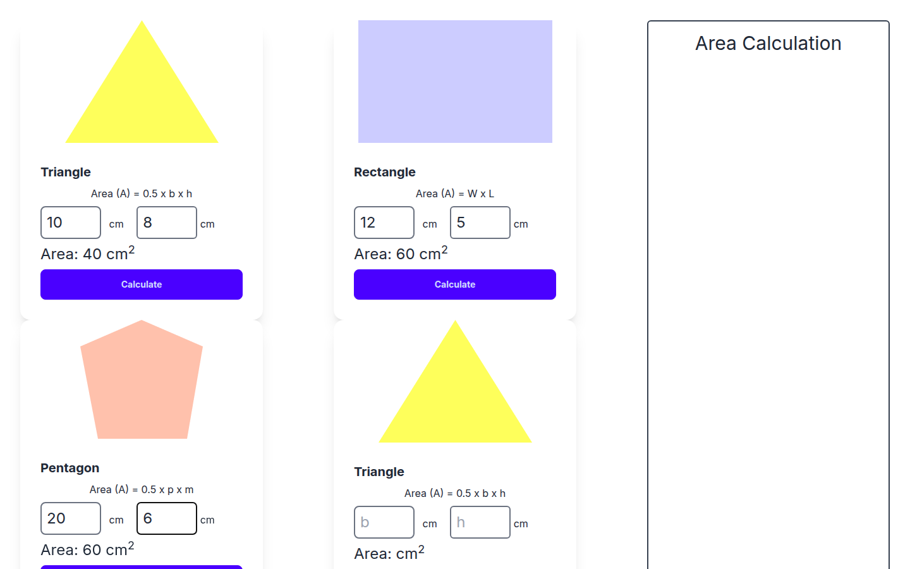

# Geometry Area Calculator

A small, responsive web app that calculates the area of common 2D shapes. You enter the dimensions and each card shows its result in cm² instantly, using plain JavaScript.

[](https://shayan-abrar.github.io/Geometry-formula-calculator-with-js/) <!-- live-demo -->




## Supported Shapes

| Shape | Formula | Inputs |
| --- | --- | --- |
| Triangle | A = 0.5 × b × h | base, height |
| Rectangle | A = W × L | width, length |
| Pentagon | A = 0.5 × p × a | perimeter, apothem |

## Features

- Card-based layout with a shape illustration, its formula and labelled inputs
- One-click **Calculate** button per shape, with the result rendered inline as `Area: … cm²`
- Decimal support: inputs are parsed with `parseFloat`
- Responsive grid built with Tailwind CSS and DaisyUI card components

## Tech Stack

| Layer | Technology |
| --- | --- |
| Markup | HTML5 |
| Styling | Tailwind CSS (Play CDN), DaisyUI 4 |
| Logic | Vanilla JavaScript (one script per shape) |

## Project Structure

```text
Geometry-formula-calculator-with-js/
├── index.html
├── scripts/
│   ├── triangle.js     # calculateTriangleArea()
│   ├── rectangle.js    # calculateRectangleArea()
│   └── pentagon.js     # calculatePentagonArea() + shared input/output helpers
├── images/             # Shape illustrations
└── tailwind.config.js
```

## Run Locally

```bash
git clone https://github.com/SHAYAN-ABRAR/Geometry-formula-calculator-with-js.git
cd Geometry-formula-calculator-with-js
# Open index.html in a browser
```

## What I Learned

- Reading input values and writing results back to the DOM
- Refactoring repeated logic into reusable helpers (`getInputValueById`, `setInnerTextById`)
- Laying out responsive card grids with Tailwind CSS

## Author

**Shayan Abrar** · [GitHub](https://github.com/SHAYAN-ABRAR) · [LinkedIn](https://www.linkedin.com/in/shayan-abrar/) · [Portfolio](https://shayan-abrar.vercel.app)
